# 🐳 AWS Docker & Elastic Beanstalk Application Deployment

## 📌 Project Overview

This project demonstrates how to containerize a web application using Docker and deploy it to AWS Elastic Beanstalk. The application was packaged inside a Docker container, uploaded to Elastic Beanstalk, and deployed successfully in a managed cloud environment.

The project helped me understand containerization, Docker images, Docker containers, Elastic Beanstalk environments, IAM roles, networking configuration, and cloud application deployment.

---

## 🎯 Objectives

* Install and configure Docker
* Create a Dockerfile
* Build a Docker image
* Run a Docker container
* Package the application for deployment
* Deploy the application using AWS Elastic Beanstalk
* Configure IAM Roles
* Configure VPC settings
* Verify successful deployment
* Clean up AWS resources

---

## 🛠️ AWS Services & Tools Used

### AWS Services

* AWS Elastic Beanstalk
* IAM
* EC2 (Managed by Elastic Beanstalk)

### Tools

* Docker
* NGINX
* Visual Studio Code
* AWS Management Console

---

## 🏗️ Architecture

User

↓

AWS Elastic Beanstalk

↓

Docker Container

↓

NGINX Web Server

↓

Web Application

---

## 📚 Key Concepts Learned

* Docker Images
* Docker Containers
* Dockerfile
* NGINX
* Containerization
* Elastic Beanstalk
* Application Deployment
* IAM Roles
* VPC Configuration
* Environment Management

---

## 🚀 Implementation Steps

1. Selected AWS Region
2. Installed Docker
3. Installed NGINX
4. Created Dockerfile
5. Built Docker Image
6. Verified Docker Containers
7. Ran Docker Container
8. Created Deployment ZIP File
9. Uploaded Application
10. Created Service Role
11. Created EC2 Role
12. Selected Default VPC
13. Created Elastic Beanstalk Environment
14. Successfully Deployed Application
15. Troubleshot Custom VPC Error
16. Deleted Resources

---

# 📸 Screenshots

## 1. Region Selected
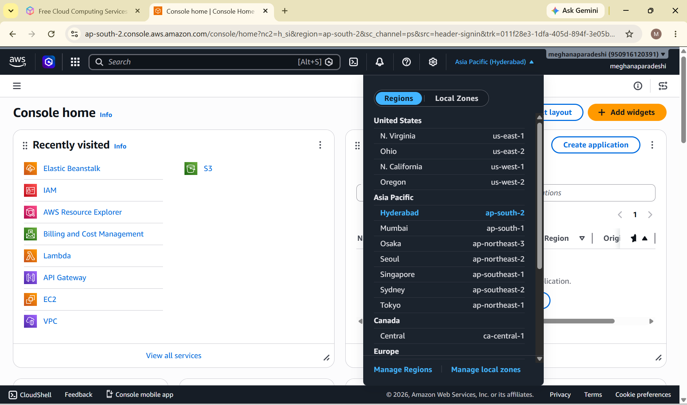

## 2. Docker Installed
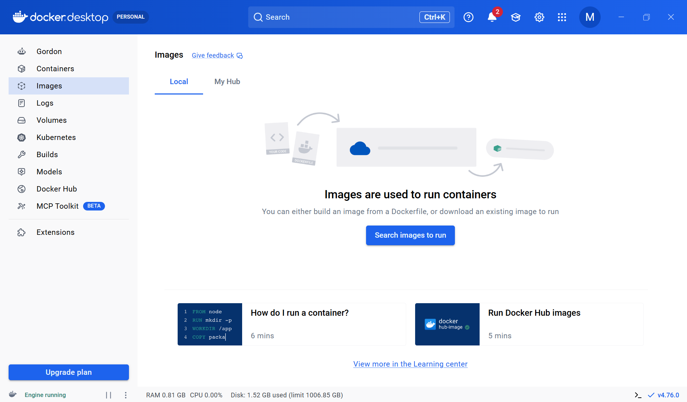

## 3. NGINX Installed
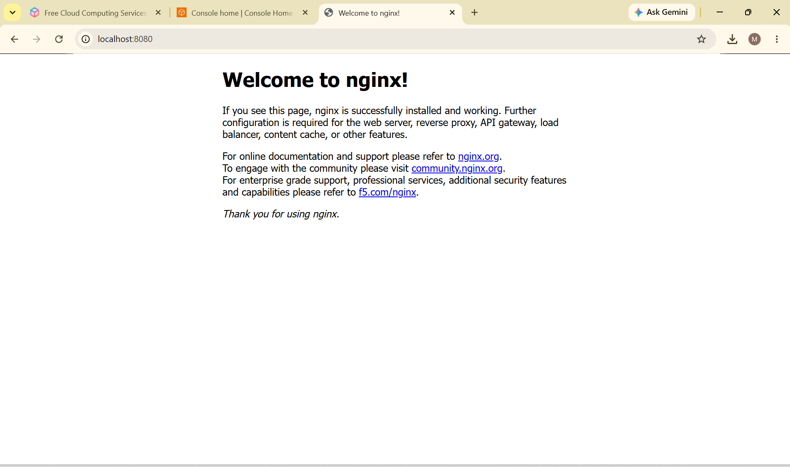

## 4. Dockerfile Created
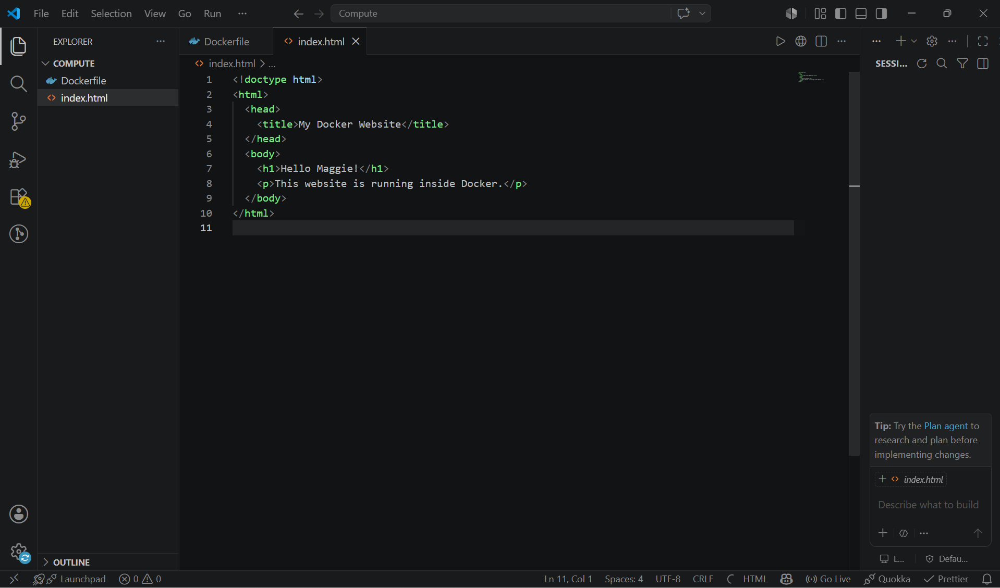

## 5. Docker Image Built
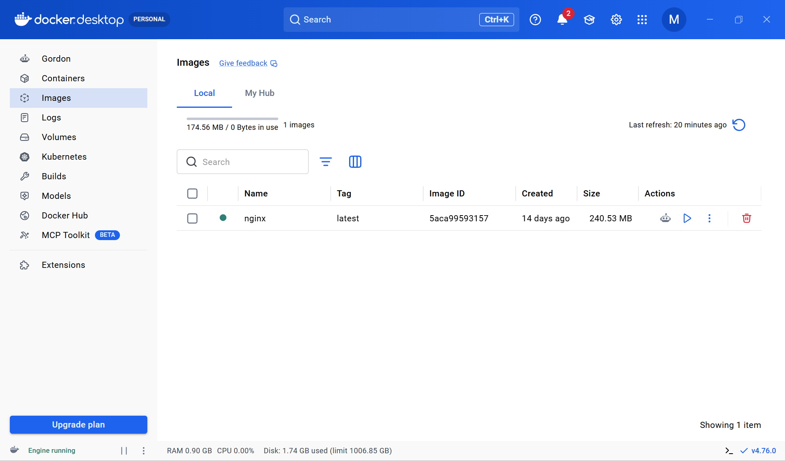

## 6. Docker Containers
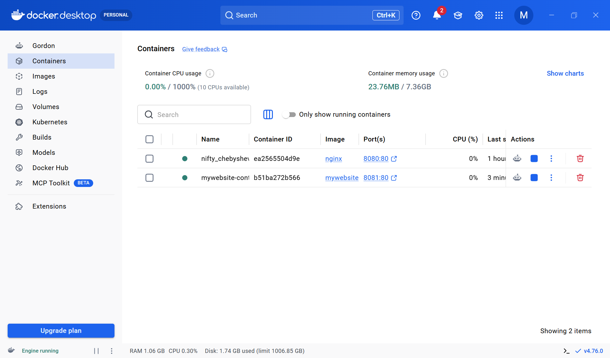

## 7. Docker Container Running
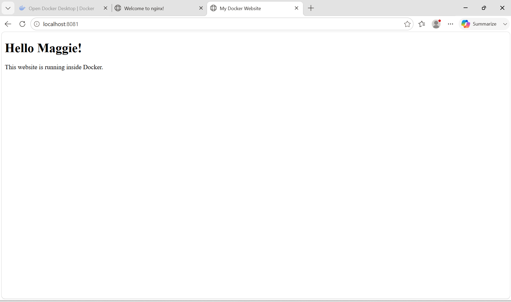

## 8. ZIP File Created
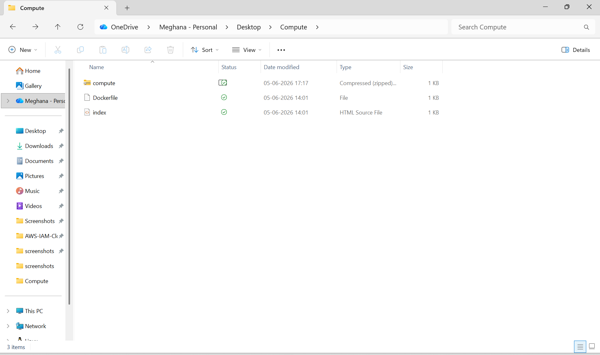

## 9. Application Uploaded
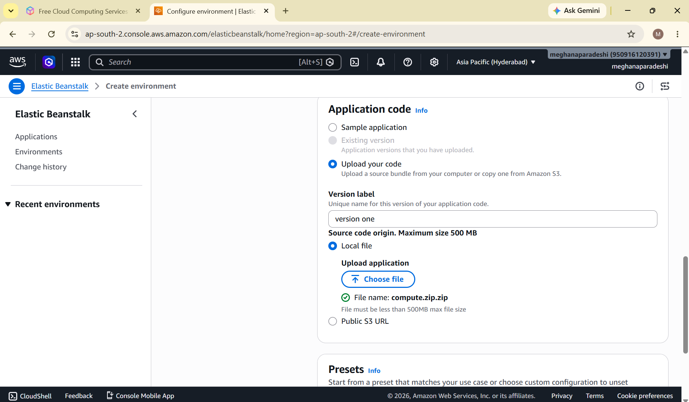

## 10. Service Role Created
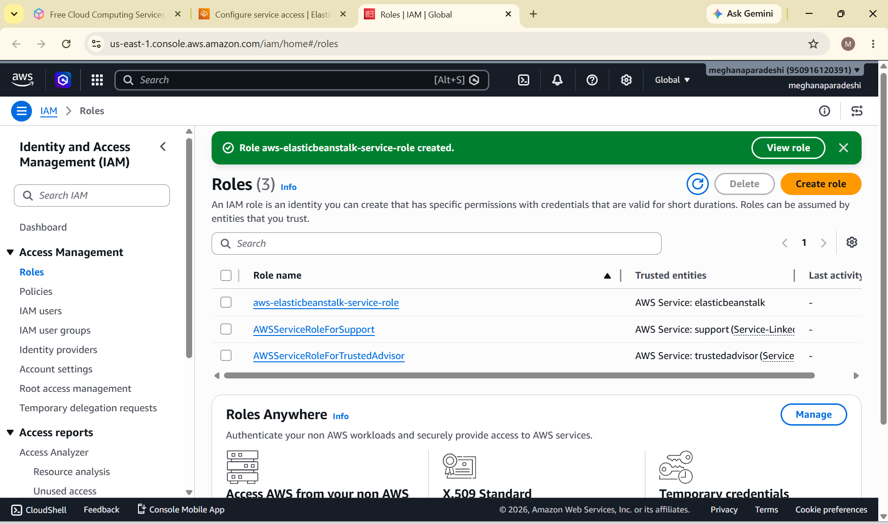

## 11. EC2 Role Created
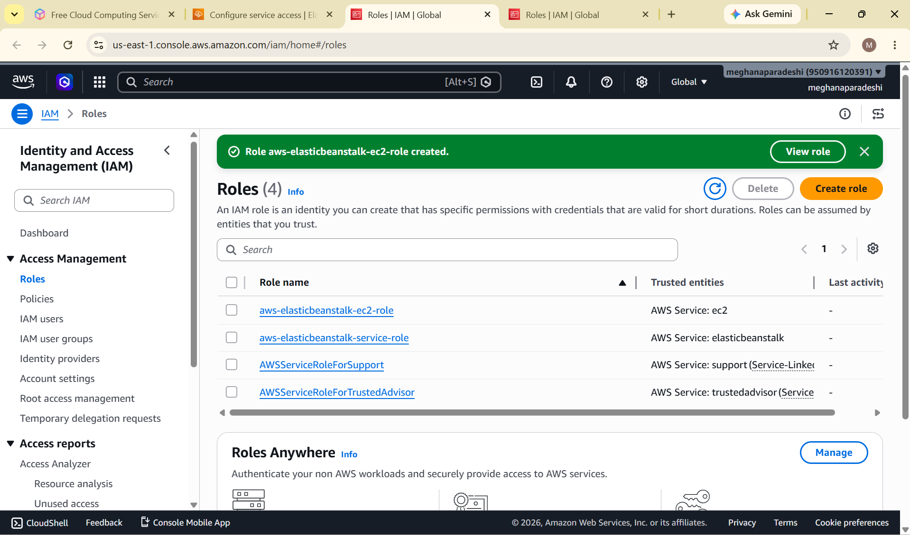

## 12. Default VPC Selected
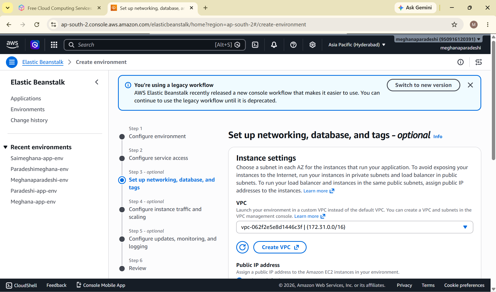

## 13. Environment Created
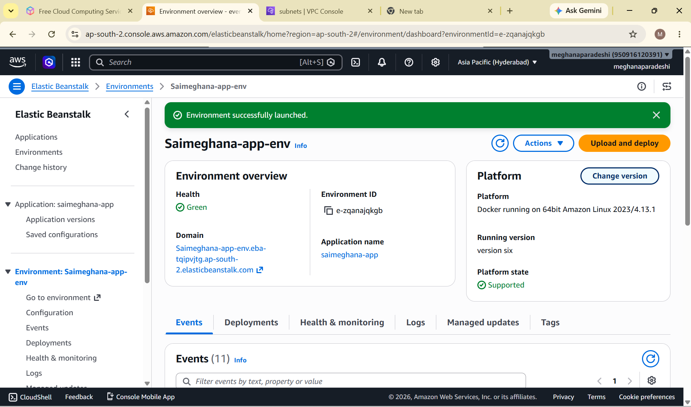

## 14. Deployment Successful
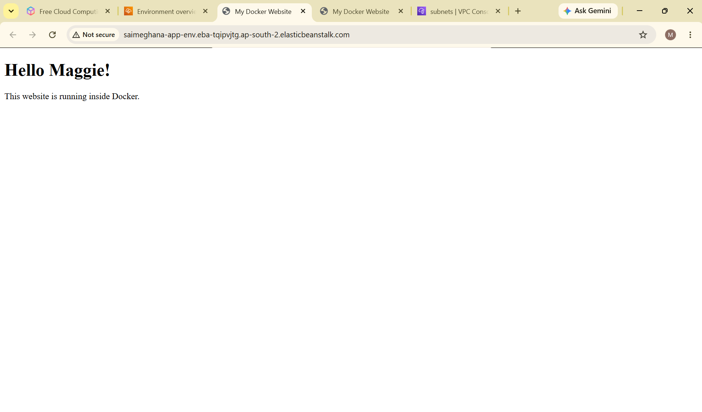

## 15. Error with Custom VPC
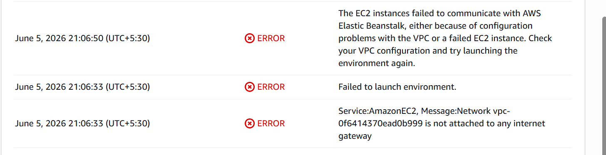

## 16. Resource Cleanup
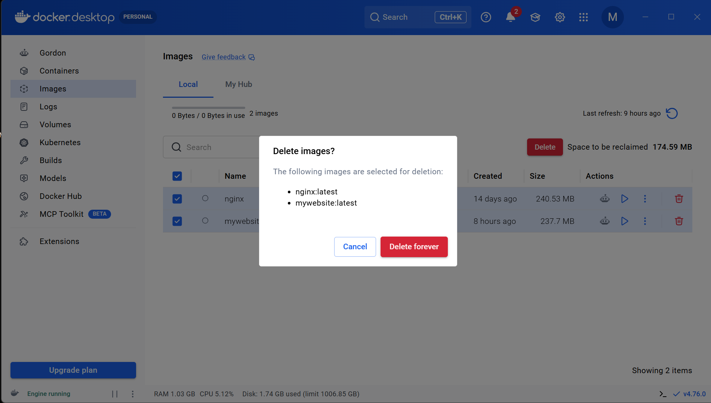

---

## ⚠️ Challenge Faced

### Custom VPC Configuration Error

While creating the Elastic Beanstalk environment, deployment failed due to incorrect VPC configuration and missing subnet settings.

### Solution

* Selected the Default VPC
* Used the available Default Subnet
* Recreated the environment successfully

---

## 🎓 Learning Outcomes

* Docker Containerization
* Docker Image Management
* Elastic Beanstalk Deployment
* IAM Role Configuration
* Cloud Hosting
* Application Packaging
* Troubleshooting Deployment Issues
* AWS Cost Management

---

## 🧹 Resource Cleanup

After successful deployment and testing, all AWS resources were deleted to avoid unnecessary charges and follow cloud cost-management best practices.

---

## 👩‍💻 Author

Meghana Paradeshi

Aspiring Cloud Engineer
